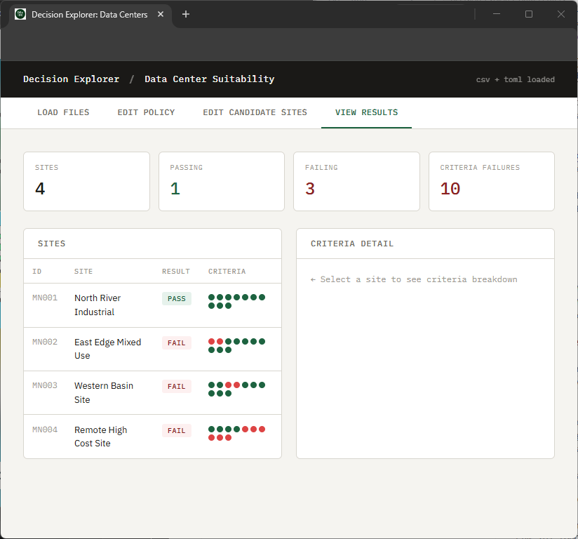
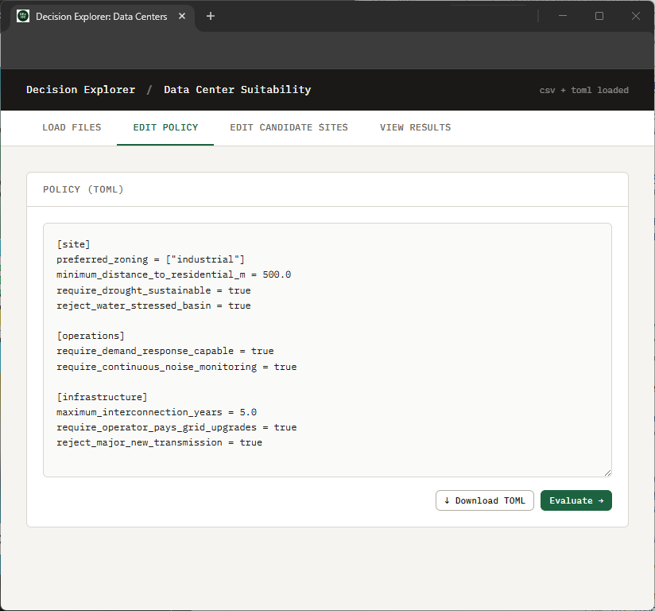
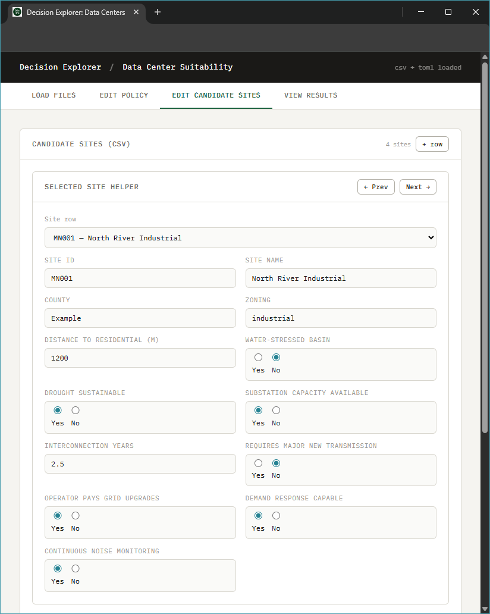

# Explorer: Age Verification

[](https://civic-interconnect.github.io/explorer-age-verification/explorer/)
[](https://civic-interconnect.github.io/explorer-age-verification/)
[](https://github.com/civic-interconnect/explorer-age-verification/actions/workflows/ci-python-zensical.yml)
[](https://github.com/civic-interconnect/explorer-age-verification/actions/workflows/links.yml)
[](#)
[](./LICENSE)

> Putting Age Verification in Context: Promise, Burden, and the Case for Sound Governance

**[Try the Interactive Explorer](https://civic-interconnect.github.io/explorer-age-verification/explorer/)**
To accept the example data and see the results, click the green "Evaluate" button in the lower right-hand corner of either:

- Policy (TOML)
- Candidates data (CSV)







## Age Verification Context

Age verification systems sit at the intersection of:

- **minor protection**
- **privacy and data exposure**
- **surveillance risk**
- **implementation complexity and user burden**

Different approaches shift these tradeoffs in materially different ways.

For example:
- stronger assurance often increases data collection and retention
- centralized systems increase coordination but raise surveillance concerns
- lower-friction systems reduce burden but may weaken protection

This project treats age verification not as a single technical problem,
but as a **governance and infrastructure design problem**.

## Dimensions of Analysis

Each candidate approach is evaluated across six dimensions:

- **Assurance Level** – strength of age verification
- **Privacy Exposure** – amount and sensitivity of user data revealed
- **Data Retention** – how long data persists
- **Centralization** – where authority and control reside
- **User Burden** – effort required by individuals
- **Reusability** – whether verification can be reused across contexts

These are combined into four interpretive lenses:

- Minor Protection
- Privacy Risk
- Surveillance Risk
- Implementation Complexity

## Patterns Evaluated

The explorer includes representative approaches such as:

- Self Declaration
- Document Upload
- Third-Party Age Token
- Device-Based Estimation
- Government Digital ID

These are not recommendations—they are **reference patterns**
for exploring structural tradeoffs.

## What the Explorer Does

The Explorer:

- applies a configurable policy (TOML)
- evaluates candidate approaches (CSV)
- computes weighted profiles across dimensions
- surfaces tensions and rule-based warnings
- enables interactive inspection of outcomes

The system is designed to make **assumptions explicit and outcomes inspectable**.

## Important Note

This project does not advocate for a specific solution.

It provides a structured way to examine:

- how design choices affect outcomes
- where tradeoffs become significant
- how governance assumptions shape results

## This Project

This project provides a structured framework for exploring tradeoffs
under explicit assumptions and constraints.
It:

- frames the issue as one of infrastructure and governance
- recognizes the distribution of costs and benefits
- emphasizes integration with broader systems rather than isolated analysis

The goal is to make tradeoffs visible and inspectable across multiple dimensions.

## Contribution

The contribution is the framework for structured exploration,
not the specific values used in any given scenario.

- Constraints, thresholds, and weights are configurable
- Assumptions are explicit and inspectable
- Results are comparative and scenario-dependent

This project does not determine outcomes or recommend decisions.
It provides a way to examine how different assumptions and constraints shape results.

## Working Files

Working files are found in these areas:

- **data/** - source inputs and scenario configuration
- **docs/** - narrative, assumptions, and analysis
- **src/** - implementation

## Current Capabilities

- Loads possible configurations from CSV and policy constraints from TOML
- Evaluates hard constraints for each candidate (PASS / FAIL)
- Evaluates scenario-level decisions (APPROVE / CONDITIONAL / REJECT)
- Exports results as JSON for the web Explorer
- Interactive web Explorer for non-technical users

## Command Reference

<details>
<summary>Show command reference</summary>

### In a machine terminal (open in your `Repos` folder)

After you get a copy of this repo in your own GitHub account,
open a machine terminal in your `Repos` folder:

```shell
# Replace username with YOUR GitHub username.
git clone https://github.com/username/explorer-age-verification

cd explorer-age-verification
code .
```

### In a VS Code terminal

```shell
uv self update
uv python pin 3.14
uv sync --extra dev --extra docs --upgrade

uvx pre-commit install
git add -A
uvx pre-commit run --all-files
# repeat if changes were made
git add -A
uvx pre-commit run --all-files

uv run python -m explorer_age_verification.cli --candidates data/raw/candidates.csv --policy data/raw/policy.toml --output-json docs/data/results.json

uv run ruff format .
uv run ruff check . --fix
uv run zensical build

git add -A
git commit -m "update"
git push -u origin main
```

Test page:

```shell
uv run python -m http.server 8000
```

</details>
